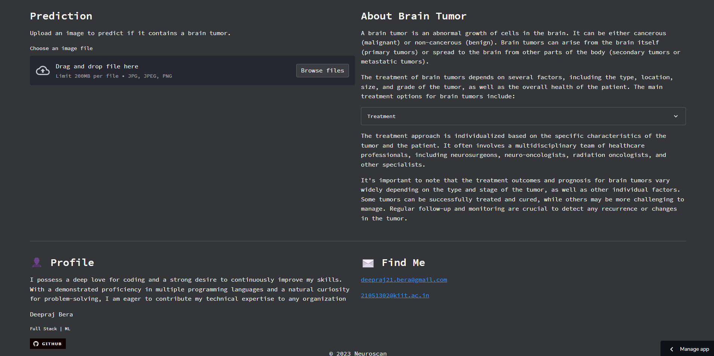

# Neuroscan

[](https://deepraj21-neuroscan-app-2oamw6.streamlit.app/)

### Project Description :

The objective of this project is to develop a machine learning model that can accurately detect brain tumors in medical imaging data, such as MRI scans. By leveraging advanced image processing techniques and machine learning algorithms, the model aims to assist healthcare professionals in the early and accurate diagnosis of brain tumors.

### Dataset

Download it from <a href='https://www.kaggle.com/datasets/jakeshbohaju/brain-tumor'>Kaggle</a>


<h3>A list of the required modules used in the code and the command to install them using pip:</h3>

```
pip install streamlit
pip install werkzeug
pip install pandas
pip install numpy
pip install tensorflow
pip install scikit-learn
pip install tqdm
pip install streamlit-lottie
pip install requests
pip install plotly
```

### Website Preview



